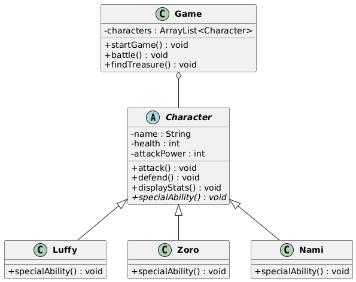
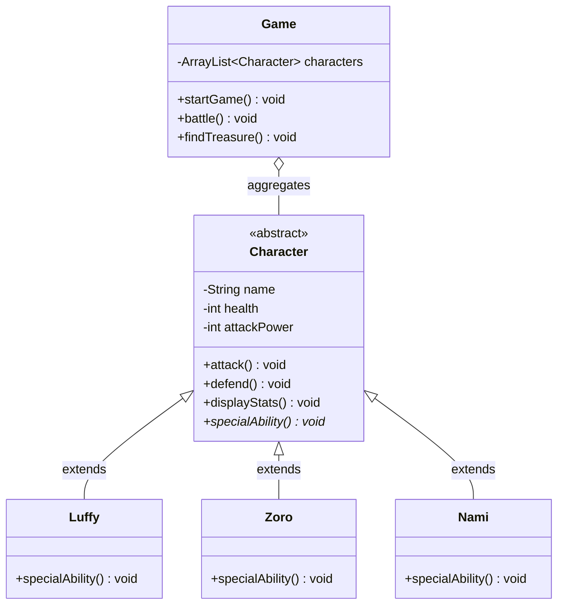

# Razan Salih
CSC325-FA25
# One Piece: The Treasure Hunt 🏴‍☠️

## Project Description

**One Piece: The Treasure Hunt** is a l game where players join Luffy and the Straw Hat Pirates on an epic quest to find hidden treasure on a mysterious island before enemy pirates defeat the crew. This text-based adventure brings the legendary anime series to life through strategic combat and exploration.

### Storyline

The Straw Hat Pirates have discovered an ancient map pointing to a legendary treasure hidden on a remote and dangerous island. As they arrive, they realize the island is crawling with rival pirate crews, treacherous weather conditions, and deadly traps designed to stop treasure hunters in their tracks.

With limited health and resources, Luffy's superhuman strength, Zoro's unmatched sword skills, and Nami's expert navigation and treasure detection abilities are the crew's only hope. Enemy pirates are closing in—can you find the treasure before it's too late?

### Main Goal

**Find the hidden treasure before enemy pirates defeat your crew!**

Navigate the mysterious island, battle rival pirates, survive harsh weather, decipher ancient clues, and locate the treasure while managing your crew's limited health.

### The Setting

The game takes place on **Mystery Island**, a treacherous location featuring:
- **Dense Jungles**: Filled with hidden enemies and secret paths
- **Ancient Ruins**: Containing cryptic clues to the treasure's location
- **Coastal Zones**: Where enemy pirate ships lurk nearby
- **Cave Systems**: Dangerous but potentially rewarding shortcuts
- **Trap-Laden Paths**: Pressure plates, spike pits, and collapsing passages

### Main Characters & Abilities

#### Monkey D. Luffy
- **Ability**: Super Strength
- **Special Power**: Gum-Gum attacks that deal massive damage to enemies
- **Role**: Primary damage dealer in combat situations

#### Roronoa Zoro
- **Ability**: Sword Combat Master
- **Special Power**: Three-Sword Style techniques with devastating precision
- **Role**: Balanced fighter with high attack power and defense

#### Nami
- **Ability**: Navigation & Treasure Detection
- **Special Power**: Can sense treasure locations and predict dangerous weather patterns
- **Role**: Strategic advantage in exploration and avoiding unnecessary battles

### Challenges

Throughout the adventure, your crew will face:

#### Enemy Pirates
- Rival treasure hunter crews with varying strength levels
- Combat encounters that drain crew health
- Strategic battles requiring ability management

#### Environmental Hazards
- **Harsh Weather**: Storms that reduce visibility and damage health
- **Deadly Traps**: Hidden mechanisms that must be avoided or disarmed
- **Limited Resources**: Health doesn't regenerate—every decision counts

#### Time Pressure
- Enemy pirates are also searching for the treasure
- The longer you take, the more encounters you'll face

### Win/Loss Conditions

#### Victory Conditions ✅
- Successfully locate and secure the hidden treasure
- At least one crew member survives with health > 0
- Overcome or avoid all major threats

#### Defeat Conditions ❌
- All crew members' health reaches zero
- Fail to find the treasure before being overwhelmed by enemies
- Fall victim to a fatal trap or environmental hazard

## Key Features

- **Object-Oriented Design**: Built with abstract classes and inheritance
- **Turn-Based Combat System**: Battle enemies using each character's unique abilities
- **Character Abilities**: Three distinct playable characters with special powers
- **Health Management**: Track crew health throughout the adventure
- **Random Events**: Dynamic battles and treasure discovery outcomes
- **Terminal Interface**: Simple text-based interaction using Java I/O
- **Story-Driven Gameplay**: Immersive narrative inspired by One Piece

## Technologies Used

- **Java SE (JDK 11+)**: Core programming language
- **Object-Oriented Programming**: Abstract classes, inheritance, and polymorphism
- **Java Collections Framework**: ArrayList for character management
- **Terminal Input/Output**: Scanner for user input, System.out for display
- **Random Class**: For simulating battles and treasure discovery

## Setup Instructions

### Prerequisites
- Java Development Kit (JDK) 11 or higher installed
- VS Code with Java Extension Pack (recommended) OR command line

### Compilation and Execution

#### Option 1: Using VS Code
1. **Clone the repository**
   ```bash
   git clone https://github.com/yourusername/onepiecetreasurehuntapp.git
   cd onepiecetreasurehuntapp
   ```

2. **Open in VS Code**
   ```bash
   code .
   ```

3. **Run the game**
   - Open `Main.java`
   - Click the "Run" button above the `main()` method
   - OR press `F5` to run with debugging

#### Option 2: Using Command Line
1. **Clone the repository**
   ```bash
   git clone https://github.com/yourusername/onepiecetreasurehuntapp.git
   cd onepiecetreasurehuntapp
   ```

2. **Compile all Java files**
   ```bash
   javac *.java
   ```

3. **Run the game**
   ```bash
   java Main
   ```

4. **Follow the terminal prompts** and enjoy the adventure!

## UML Class Diagram

The game architecture follows object-oriented design principles with abstract classes, inheritance, and aggregation:



**To generate the diagram image, choose one of these methods:**

### Method 1: Mermaid Live Editor (Recommended)
1. Visit **[Mermaid Live Editor](https://mermaid.live/)**
2. Copy and paste the code below:



3. Click **"Download PNG"** button
4. Save the image as `uml_diagram.png` in your project folder

### Method 2: PlantUML Online
1. Visit **[PlantUML Online Server](http://www.plantuml.com/plantuml/uml/)**
2. Copy contents from `UML_Diagram.puml` file in this repository
3. Paste and download the PNG
4. Save as `uml_diagram.png`

### Class Structure Overview

- **Character (Abstract Class)**: Defines common attributes (`name`, `health`, `attackPower`) and methods (`attack()`, `defend()`, `displayStats()`) shared by all characters. Contains abstract method `specialAbility()` that subclasses must implement.
- **Luffy, Zoro, Nami (Concrete Subclasses)**: Extend Character and provide unique implementations of `specialAbility()` reflecting their distinct combat styles.
- **Game (Manager Class)**: Orchestrates gameplay by managing an ArrayList of Character objects, handling battles, and determining treasure discovery through aggregation.

## Future Improvements

- **Additional Characters**: Add more Straw Hat Pirates crew members (Sanji, Usopp, Chopper, Robin) with unique abilities
- **Enemy Classes**: Create an Enemy abstract class with specific enemy types (Marines, Rival Pirates, Sea Beasts)
- **Multiple Islands/Maps**: Expand to different islands with unique challenges and treasures
- **Inventory System**: Implement items, power-ups, and equipment that characters can collect and use
- **Save/Load Functionality**: Use file I/O to save game progress and load previous sessions
- **Difficulty Levels**: Add Easy, Medium, and Hard modes with scaling enemy strength
- **Boss Battles**: Introduce powerful boss enemies with special attack patterns
- **GUI Version**: Port the game to JavaFX or Swing for a graphical interface
- **Experience System**: Add leveling up mechanics where characters grow stronger over time
- **Achievement Tracking**: Implement a system to track player accomplishments
- **ASCII Art**: Enhance visual presentation with character sprites and scene artwork
- **Sound Effects**: Integrate Java audio libraries for background music and effects

## Project Structure

```
Onepiecetreasurehuntapp/
├── Character.java      (Abstract base class)
├── Luffy.java         (Concrete character class)
├── Zoro.java          (Concrete character class)
├── Nami.java          (Concrete character class)
├── Game.java          (Game logic manager)
├── Main.java          (Entry point)
├── UML_Diagram.puml   (PlantUML source for class diagram)
├── uml_diagram.png    (Generated UML diagram image - create this)
└── README.md          (This file)
```

---

**Ready to set sail with the Straw Hat Pirates? The treasure awaits! ⚓💰**
